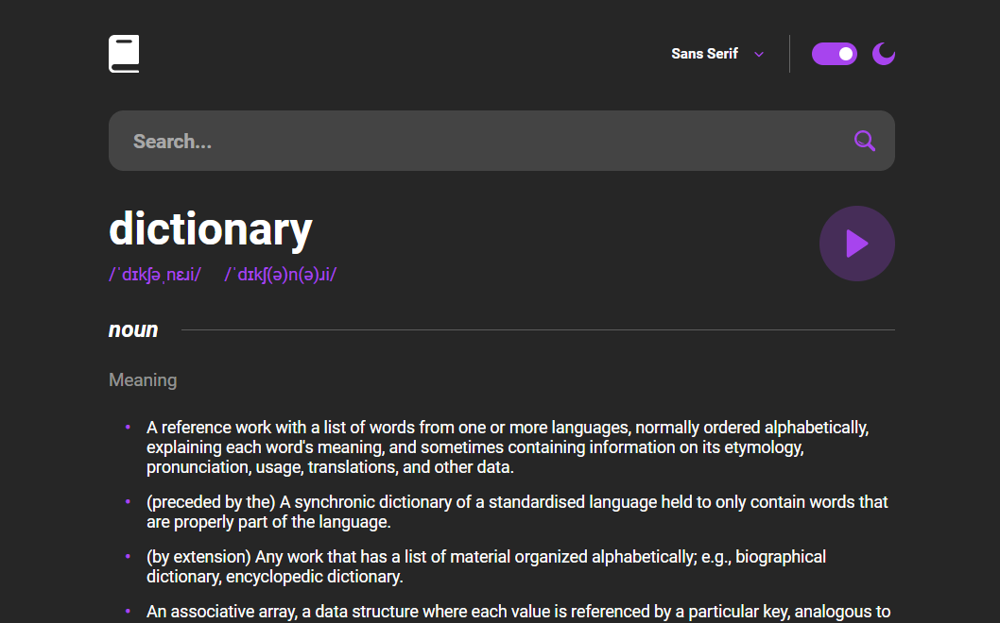

    

<h1 align="center">Dictionary</h1>

<h2 align="center">
    <a href="https://profpopoff.github.io/Dictionary/">Live Demo</a>
</h2>

---

## About the project

This is my solution to the <a href="https://www.frontendmentor.io/challenges/dictionary-web-app-h5wwnyuKFL">Dictionary</a> challenge from Frontend Mentor. 

### Technological stack:

- Vue
- REST API
  
### Functional requirements:

- Search for words using the input field
- See the Free Dictionary API's response for the searched word
- See a form validation message when trying to submit a blank form
- Play the audio file for a word when it's available
- Switch between serif, sans serif, and monospace fonts
- Switch between light and dark themes
- View the optimal layout for the interface depending on their device's screen size
- See hover and focus states for all interactive elements on the page
- Have the correct color scheme chosen for them based on their computer preferences.
